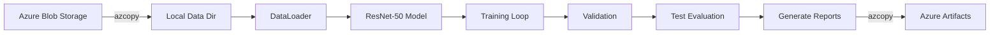

# 🩺 Chest X-Ray Pneumonia Detection with Azure HPC

[](https://www.python.org/downloads/)
[](https://pytorch.org/)
[](https://azure.microsoft.com/)
[](https://slurm.schedmd.com/)

An end-to-end **deep learning pipeline** for automated pneumonia detection from chest X-ray images. This project demonstrates production-ready ML engineering practices including cloud data integration, HPC job scheduling, model training, evaluation, and artifact management.

---

## 📋 Table of Contents

- [Project Overview](#-project-overview)
- [Key Features](#-key-features)
- [Architecture](#-architecture)
- [Tech Stack](#-tech-stack)
- [Project Structure](#-project-structure)
- [Quick Start](#-quick-start)
- [Configuration](#-configuration)
- [Training Pipeline](#-training-pipeline)
- [Model Performance](#-model-performance)
- [Cloud Integration](#-cloud-integration)
- [Future Improvements](#-future-improvements)

---

## 🎯 Project Overview

This project implements a **binary classification model** to detect pneumonia from chest X-ray images using transfer learning with ResNet-50. The pipeline is designed for **scalable HPC environments** with seamless Azure Blob Storage integration for data management and artifact versioning.

### Problem Statement
Pneumonia is a leading cause of death worldwide. Early and accurate diagnosis through chest X-rays can significantly improve patient outcomes. This project automates the detection process using deep learning, achieving **high accuracy** on the benchmark dataset.

### Dataset
- **Source**: [Chest X-Ray Images (Pneumonia)](https://www.kaggle.com/datasets/paultimothymooney/chest-xray-pneumonia) from Kaggle
- **Classes**: NORMAL (healthy) vs PNEUMONIA (infected)
- **Total Images**: ~5,800 labeled chest X-ray images
- **Split**: Train / Validation / Test

---

## ✨ Key Features

| Feature | Description |
|---------|-------------|
| 🔄 **End-to-End Pipeline** | Single SLURM script handles data download → training → evaluation → cloud upload |
| ☁️ **Azure Integration** | Automatic data fetching from Azure Blob Storage with SAS token authentication |
| 🖥️ **HPC Ready** | Optimized for SLURM-based GPU clusters (tested on V100-32GB) |
| 📊 **Auto-Generated Reports** | Training metrics, confusion matrix, and loss curves saved automatically |
| 🔁 **Reproducible** | Seeded experiments with YAML configuration files |
| 📦 **Artifact Versioning** | Run outputs uploaded to Azure with timestamp-based versioning |

---

## 🏗 Architecture

```
┌─────────────────────────────────────────────────────────────────────────┐
│                           SLURM HPC Cluster                              │
├─────────────────────────────────────────────────────────────────────────┤
│                                                                          │
│   ┌──────────────┐     ┌──────────────┐     ┌──────────────────────┐    │
│   │ Azure Blob   │────▶│  GPU Node    │────▶│  Azure Blob Storage  │    │
│   │ (Datasets)   │     │  - Download  │     │  (Artifacts/Runs)    │    │
│   └──────────────┘     │  - Train     │     └──────────────────────┘    │
│                        │  - Evaluate  │                                  │
│                        │  - Report    │                                  │
│                        │  - Upload    │                                  │
│                        └──────────────┘                                  │
│                                                                          │
└─────────────────────────────────────────────────────────────────────────┘
```

### Training Flow



---

## 🛠 Tech Stack

| Category | Technologies |
|----------|--------------|
| **Deep Learning** | PyTorch, TorchVision, CUDA 12.6 |
| **Model Architecture** | ResNet-50 (ImageNet pretrained) |
| **Data Processing** | NumPy, Pillow, scikit-learn |
| **Visualization** | Matplotlib |
| **Configuration** | PyYAML |
| **Cloud Storage** | Azure Blob Storage, azcopy |
| **HPC** | SLURM Workload Manager |
| **Hardware** | NVIDIA Tesla V100S-32GB |

---

## 📁 Project Structure

```
azure-hpc-medical-imaging/
├── configs/
│   └── train_resnet50.yaml      # Hyperparameters & paths
├── slurm/
│   └── end_to_end_train_upload.sbatch  # HPC job script
├── src/
│   └── training/
│       ├── train.py             # Main training script
│       └── make_report.py       # Metrics visualization
├── requirements.txt
└── README.md
```

### Output Structure (per run)
```
work/runs/YYYYMMDD_HHMMSS_resnet50/
├── best_model.pt                # Trained model weights
├── config.yaml                  # Run configuration
├── metrics.json                 # All metrics (train/val/test)
├── report.json                  # Summary report
└── plots/
    ├── loss.png                 # Training loss curve
    └── confusion_matrix.png     # Test set confusion matrix
```

---

## 🚀 Quick Start

### Prerequisites

1. **Environment Setup**
   ```bash
   conda create -n infra_env python=3.10
   conda activate infra_env
   pip install -r requirements.txt
   ```

2. **Azure SAS Tokens** (required for cloud data access)
   ```bash
   export AZ_DATASETS_SAS_URL="https://<storage>.blob.core.windows.net/datasets?<sas-token>"
   export AZ_ARTIFACTS_SAS_URL="https://<storage>.blob.core.windows.net/artifacts?<sas-token>"
   ```

### Run Training

```bash
# Submit to SLURM cluster
cd azure-hpc-medical-imaging
sbatch slurm/end_to_end_train_upload.sbatch
```

### Monitor Job
```bash
# Check job status
squeue -u $USER

# View logs (replace JOB_ID)
tail -f ../work/logs/cxr_e2e_r50_<JOB_ID>.out
```

---

## ⚙️ Configuration

Edit `configs/train_resnet50.yaml` to customize training:

```yaml
# Model & Training
seed: 42              # Reproducibility
epochs: 5             # Training epochs
batch_size: 32        # Batch size
lr: 0.0003            # Learning rate (AdamW)
num_workers: 4        # DataLoader workers
img_size: 224         # Input image size
model: resnet50       # Model architecture
num_classes: 2        # NORMAL vs PNEUMONIA

# Paths
paths:
  local_data_root: /path/to/data/chestxray/raw
  run_root: /path/to/work/runs
```

---

## 🔬 Training Pipeline

### 1. Data Loading
- Images loaded via `torchvision.datasets.ImageFolder`
- **Training augmentations**: Resize → RandomHorizontalFlip → Normalize
- **Evaluation**: Resize → Normalize

### 2. Model Architecture
```
ResNet-50 (ImageNet pretrained)
│
├── Backbone: 50-layer residual network
│   └── Frozen: No (full fine-tuning)
│
└── Classifier Head: Linear(2048 → 2)
```

### 3. Training Loop
- **Optimizer**: AdamW
- **Loss**: CrossEntropyLoss
- **Validation**: Per-epoch accuracy, F1, AUC-ROC

### 4. Output Artifacts
| Artifact | Description |
|----------|-------------|
| `best_model.pt` | PyTorch model state dict |
| `metrics.json` | Full training history + test metrics |
| `report.json` | Compact summary for dashboards |
| `plots/loss.png` | Training loss curve |
| `plots/confusion_matrix.png` | Test set confusion matrix |

---

## 📈 Model Performance

### Latest Training Run Results

| Metric | Validation (Epoch 5) | Test Set |
|--------|---------------------|----------|
| **Accuracy** | 100.0% | TBD |
| **F1 Score** | 1.0000 | TBD |
| **AUC-ROC** | 1.0000 | TBD |

### Training Progress
```
Epoch 1: loss=0.1094  val_acc=68.75%  val_f1=0.76  val_auc=1.00
Epoch 2: loss=0.0522  val_acc=68.75%  val_f1=0.76  val_auc=1.00
Epoch 3: loss=0.0366  val_acc=87.50%  val_f1=0.89  val_auc=1.00
Epoch 4: loss=0.0274  val_acc=75.00%  val_f1=0.80  val_auc=1.00
Epoch 5: loss=0.0266  val_acc=100.0%  val_f1=1.00  val_auc=1.00
```

---

## ☁️ Cloud Integration

### Data Flow

1. **Download** (Azure → Local)
   ```bash
   azcopy copy "${AZURE_BLOB}/chestxray/raw/?${SAS}" "./data/" --recursive
   ```

2. **Upload Artifacts** (Local → Azure)
   ```bash
   azcopy copy "./runs/${RUN_ID}/*" "${AZURE_BLOB}/runs/${RUN_ID}/" --recursive
   ```

### Benefits
- 📦 **Centralized datasets** across HPC nodes
- 🔄 **Versioned artifacts** with timestamp-based directories
- 🔐 **Secure access** via SAS tokens (no credentials in code)
- 🌐 **Accessible results** from anywhere via Azure portal

---

## 🔮 Future Improvements

- [ ] **Multi-class Classification**: Extend to detect specific pneumonia types (bacterial vs viral)
- [ ] **Model Registry**: Integration with MLflow or Azure ML for model versioning
- [ ] **Hyperparameter Tuning**: Automated search with Optuna or Ray Tune
- [ ] **Grad-CAM Visualization**: Explainability for medical professionals
- [ ] **REST API Deployment**: FastAPI + Docker for inference serving
- [ ] **CI/CD Pipeline**: Automated testing and deployment with GitHub Actions

---

## 👤 Author

**Pari Kodumuru**  
*ML Engineer | Medical Imaging | HPC Computing*

---

## 📄 License

This project is for educational and research purposes.

---

<p align="center">
  <i>Built with 🔬 for advancing medical AI on HPC infrastructure</i>
</p>
